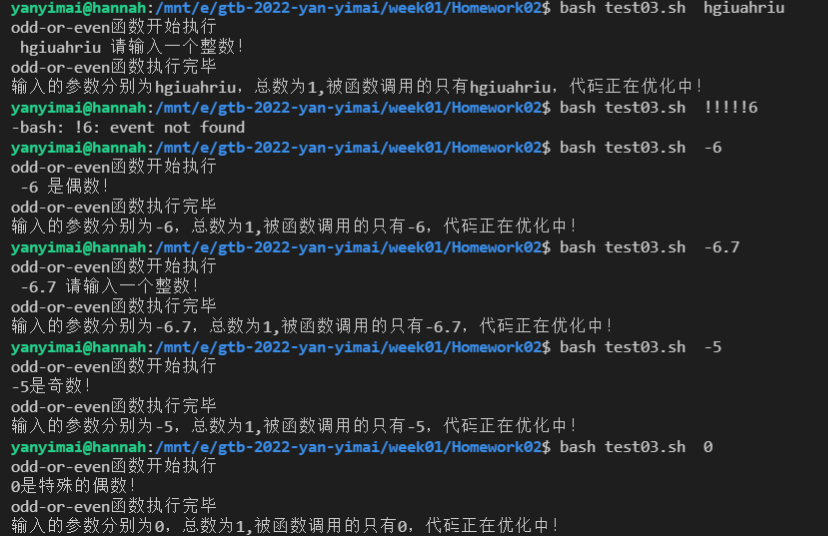

# week01
# _1-5 Homework of CLI Basics_

**题目和解答**

1. 找到在 Ubuntu 系统中可以用于计算文件内容 [MD5](https://www.jianshu.com/p/81c30781d4f7) 值的命令

   需要先进入被验证文件的亲目录中。测试Beta.zip文件的md5.

   ```
   yanyimai@hannah:/mnt/c/Users/YiMai/Desktop$ md5sum  Beta.zip
   973da8327eab16455beb668a976b63ed  Beta.zip
   ```

   

2. 找到在 Ubuntu 系统中可以用于比较两个文件的内容的差异的命令

   ```
   yanyimai@hannah:/mnt/e/gtb-2022-yan-yimai/week01/Homework02$ diff 01.txt 01copy.txt
   yanyimai@hannah:/mnt/e/gtb-2022-yan-yimai/week01/Homework02$ diff 01.txt 01bdo.txt
   1c1
   < 123
   ---
   > 321
   ```

   

3. 实现一个名为 `odd-or-even` 的 function，可以用来判断给其提供的第一个参数是奇数还是偶数，奇数时输出 `odd`，偶数时输出 `even`

   
   
   ```
   #!/bin/bash
   echo "odd-or-even函数开始执行"
   
   odd-or-even()
   {
     
        
       
       if [[ $1 =~ ^-?[1-9]\d*$ ]] && [[ $(($1 % 2)) = 0 ]];then
         y=$1
   	    echo " $1 是偶数！"
       elif [[ $1 =~ ^-?[1-9]\d*$ ]] && [[ $(($1 % 2)) -ne 0 ]];then
       echo "$1是奇数！"
       elif [[ $1 = 0 ]];then
       echo "$1是特殊的偶数！"
       else
       echo " $1 请输入一个整数！"
       fi
   
       
   }
   odd-or-even $1 
   echo "odd-or-even函数执行完毕"
   echo "输入的参数分别为$@，总数为$#,被函数调用的只有$1，代码正在优化中！"
   ```
   
   
   
4. 实现一个名为 `next` 的脚本，当在 CLI 里执行 `$ next` （`$`为提示符，不需要输入）时就返回一个整数，第一次返回 1，每执行一次加 1

   

   ```
   #!/bin/bash
   #logfile储存在$PWD/nextfile.txt
   #可以在任何地方运行next
   #!/bin/bash
   
   function next(){
   
   
   nextfile="$PWD/nextfile.txt"
   if [[ ! -e $nextfile ]];then
   
    execount=1
   
    touch $nextfile $nextfile
   
    echo $execount
   
    echo $execount > ./nextfile.txt
   
    echo  "nextfile.txt成功创建 "
   
   else
     execount=`tail -n 1 nextfile.txt`
     execount=`expr $execount + 1`
     echo $execount > ./nextfile.txt
     echo $execount
     echo "执行结束"
     
   fi
   }
   next $1
   
   ```

   

5. 一个文件含有 N 行内容，每行的内容都是一个大于等于 0 的整数，无任何空行或其它内容，使用 [one-liner](https://onceupon.github.io/Bash-Oneliner/) 的形式对该文件中的数字求和

   
   
   ```
   使用非oneliner形式--大失败><
   round(10*rand(10))matlab生成一组10✖10的整数，测试。
     
   #!/bin/bash
   #测试文件是numbers.txt，里面是100*1个整数，有100行。$a是数组下标
   
   function read-and-sum(){
   a=0
   while read line
   do
     
           results[$a]=$line
           ((a++))
                           
                             
   done < numbers.txt
   
    temp=`echo  "$line" | tr -cd "[0-9]" `
    
    echo $temp 
   
   
   }
   read-and-sum
   
   
   ```
   
   ```
   使用onliner形式 
   awk '{s+=$1} END {print s}' numbers.txt 
   ```
   
   

***

**参考链接**

_第一题_

1.[MD5_百度百科 (baidu.com)](https://baike.baidu.com/item/MD5/212708?fr=aladdin)

2.[验证MD5校验和 - Ubuntu中文](https://wiki.ubuntu.org.cn/验证MD5校验和)

3.在cmd中验证的代码

```
C:\Users\YiMai>certutil -hashfile "C:\Users\YiMai\Desktop\Dynamic DNS Client 2.0.0.7 Beta.zip"
SHA1 的 C:\Users\YiMai\Desktop\Dynamic DNS Client 2.0.0.7 Beta.zip 哈希:
c03ffef03406311ff68740f8e7562d5db10200c9
CertUtil: -hashfile 命令成功完成。
```

_第二题_

1. [Ubuntu中如何比较两个不同的文件？ - 51CTO.COM](https://os.51cto.com/art/201108/287762.htm)

_第三题 第四题 第五题_

1. [正则表达式 整数 - 先锋之客 - 博客园 (cnblogs.com)](https://www.cnblogs.com/xianfengzhike/p/9525814.html)
2. [(38条消息) Shell脚本的基本语法（一） if判断、for循环、while循环和until循环_迷雾江湖 的博客-CSDN博客](https://blog.csdn.net/SunXiWang/article/details/78636827?ops_request_misc=%7B%22request%5Fid%22%3A%22163716774616780265423287%22%2C%22scm%22%3A%2220140713.130102334..%22%7D&request_id=163716774616780265423287&biz_id=0&utm_medium=distribute.pc_search_result.none-task-blog-2~all~baidu_landing_v2~default-1-78636827.first_rank_v2_pc_rank_v29&utm_term=shell里面的if循环&spm=1018.2226.3001.4187)
3. [(38条消息) shell整除取余_weixin_33858485的博客-CSDN博客](https://blog.csdn.net/weixin_33858485/article/details/92106544?ops_request_misc=%7B%22request%5Fid%22%3A%22163716785516780265422326%22%2C%22scm%22%3A%2220140713.130102334..%22%7D&request_id=163716785516780265422326&biz_id=0&utm_medium=distribute.pc_search_result.none-task-blog-2~all~sobaiduend~default-1-92106544.first_rank_v2_pc_rank_v29&utm_term=shell中取余&spm=1018.2226.3001.4187)
4. [千万别混淆 Bash/Zsh 的四种运行模式 - 知乎 (zhihu.com)](https://zhuanlan.zhihu.com/p/47819029)
5. [(38条消息) shell脚本中函数的调用_taranfly的博客-CSDN博客_shell 函数调用](https://blog.csdn.net/taranfly/article/details/80253416?ops_request_misc=%7B%22request%5Fid%22%3A%22163724707216780271913264%22%2C%22scm%22%3A%2220140713.130102334..%22%7D&request_id=163724707216780271913264&biz_id=0&utm_medium=distribute.pc_search_result.none-task-blog-2~all~baidu_landing_v2~default-2-80253416.first_rank_v2_pc_rank_v29&utm_term=shell+怎么调用函数&spm=1018.2226.3001.4187)
6. [(39条消息) #!/bin/bash详解_wangxin 的专栏-CSDN博客](https://blog.csdn.net/wangxin6722513/article/details/44922695)
7. [SHELL 读取文件的每一行内容并输出 | 菜鸟教程 (runoob.com)](https://www.runoob.com/w3cnote/shell-read-line.html)
8. [(39条消息) Shell脚本：while read line无法读取最后一行的问题_weixin_30872499的博客-CSDN博客](https://blog.csdn.net/weixin_30872499/article/details/96798067?spm=1001.2101.3001.6650.1&utm_medium=distribute.pc_relevant.none-task-blog-2~default~CTRLIST~default-1.no_search_link&depth_1-utm_source=distribute.pc_relevant.none-task-blog-2~default~CTRLIST~default-1.no_search_link)
9. [Linux shell脚本，有一个:lew.sh脚本里面有一个sum参数，如何让脚本每执行一次，sum就会自动加1_百度知道 (baidu.com)](https://zhidao.baidu.com/question/182773939.html)
10. [linux必会知识 - 知乎 (zhihu.com)](https://zhuanlan.zhihu.com/p/29078180)
11. [(39条消息) shell脚本之环境变量_myhyyyyyy的博客-CSDN博客_shell脚本环境变量](https://blog.csdn.net/myhyyyyyy/article/details/91834776?ops_request_misc=%7B%22request%5Fid%22%3A%22163734246216780274188367%22%2C%22scm%22%3A%2220140713.130102334..%22%7D&request_id=163734246216780274188367&biz_id=0&utm_medium=distribute.pc_search_result.none-task-blog-2~all~sobaiduend~default-2-91834776.first_rank_v2_pc_rank_v29&utm_term=shell脚本设置环境变量&spm=1018.2226.3001.4187)
12. https://blog.csdn.net/ee230/article/details/48316317
13. https://blog.csdn.net/yabingshi_tech/article/details/114364672

***

**学到的知识**

指令

```
echo/vim/nano/chmod a+x ~/bin/h2/man /help/type/tldr/mkdir
/touch/cat/ifconfig/history/iwconfig/ping google.com/uname-a/top
rm谨慎使用
yanyimai@hannah:~$ whatis ls
ls (1)               - list directory contents
```

制作一个alias指令

```
制作一个当前的指令
yanyimai@hannah:~$ echo $USER
yanyimai
yanyimai@hannah:~$ alias showuser='echo $USER'
yanyimai@hannah:~$ showuser
yanyimai

制造一个永久的指令
yanyimai@hannah:~$ nano .bashrc
在nano中编辑——alias showuser='echo $USER'
yanyimai@hannah:~$ showuser
yanyimai


```


***


**疑问**

1. 正则表达式的优雅书写方式。

2. 在cmd中验证和ubuntu中的md5值不一致，疑惑。

3. 在txt文件中如何将字符串转为数组

4. 如何使用以下代码创建自定义命令，而不是用alias手动配置一遍

   ```
   PATH=$PATH:$HOME/bin
   export PATH
   ```

   


[^此仓库关联本地E:\gtb-2022-yan-yimai\work-repo\week01\cli homework；关联线上org页面week01仓库]: 
